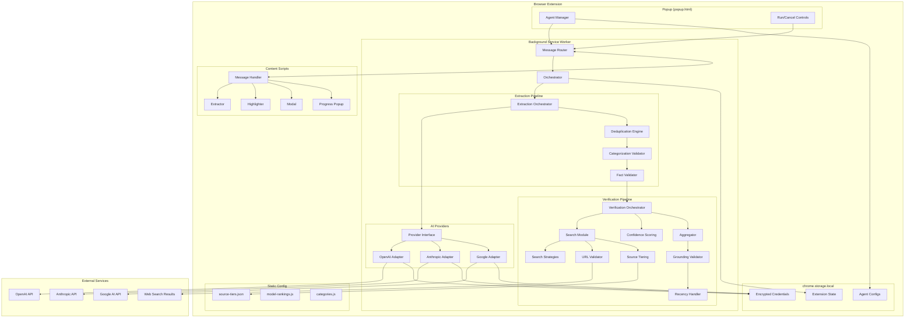
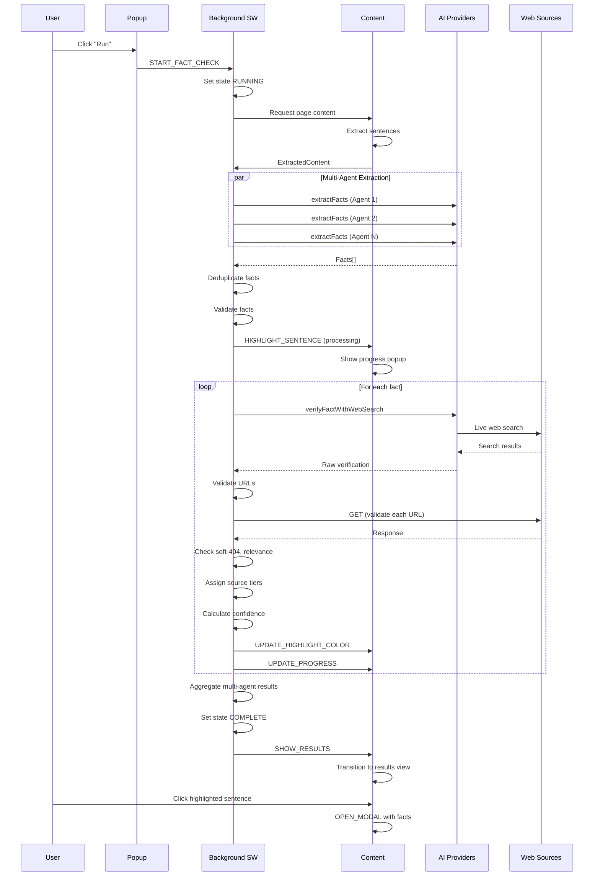
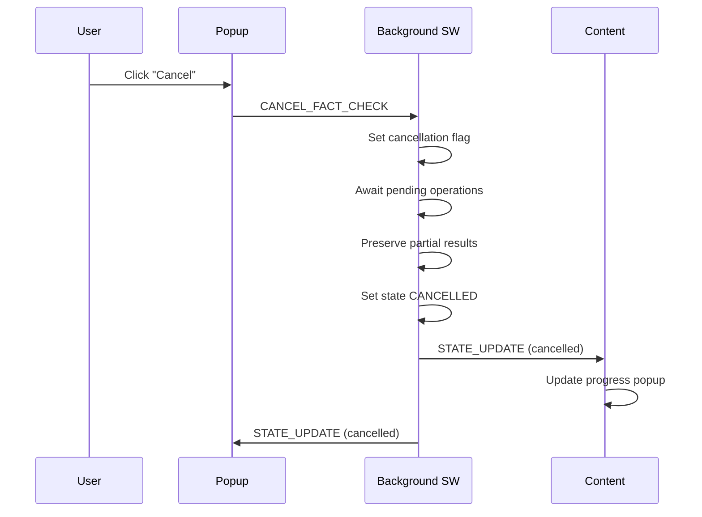
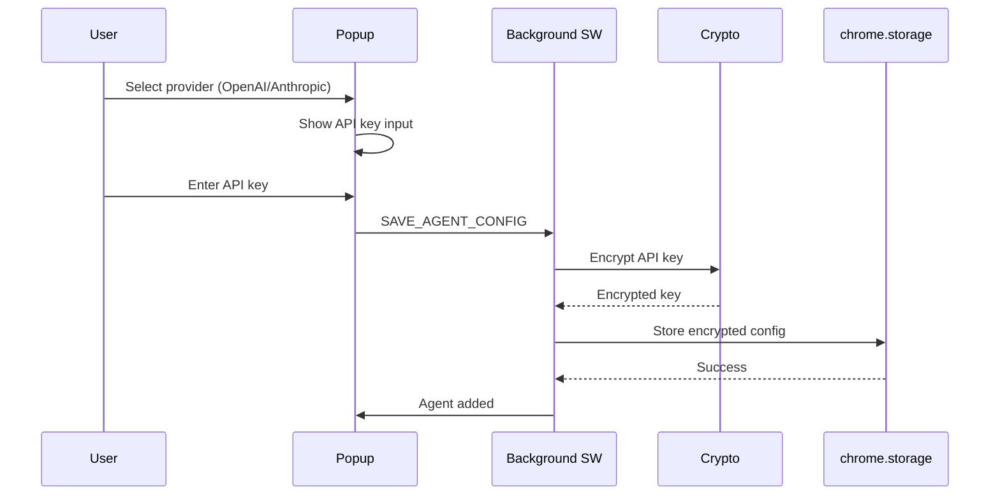
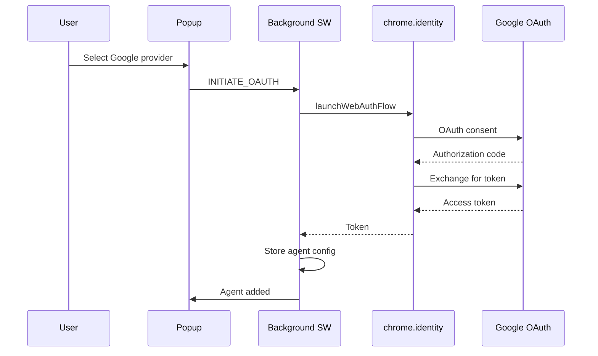
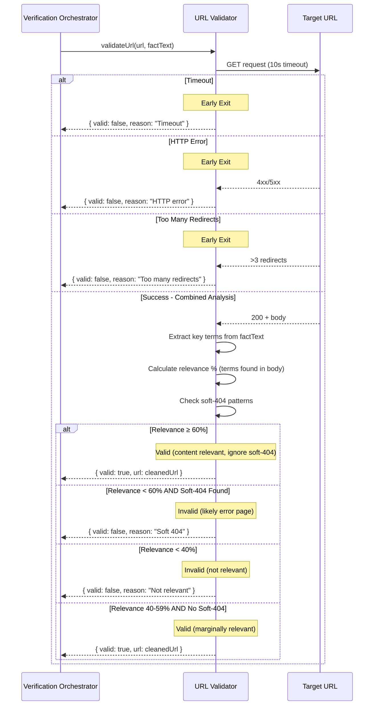

# DESIGN DOCUMENT

# TruthSeek: Fact-Checking Browser Extension

---

## 1. Overview

### Summary of the Feature/Changes

TruthSeek is a **greenfield browser extension** that enables users to verify the factual accuracy of any HTML webpage using one or more AI models. The extension extracts verifiable facts from page content, performs live web searches to verify each fact, calculates confidence scores based on source credibility, and displays results through real-time page highlighting and interactive modals.

### In-Scope

- Chrome Extension (Manifest V3) with popup UI, background service worker, and content scripts
- AI provider integration: OpenAI, Anthropic (API key), Google/Gemini (OAuth)
- Fact extraction with 9-category taxonomy and DOM location tracking
- Multi-agent orchestration with deduplication and model-quality tiebreaking
- Live web search verification using provider-native search tools
- Mandatory URL validation with soft-404 detection and content relevance checking
- Source credibility tiering (static, category-specific)
- Confidence scoring with evidence-based caps
- Real-time sentence highlighting and interactive fact modals
- Progress tracking with close/hide functionality
- Security: encrypted API key storage, CSP, input sanitization

### Out-of-Scope

- Firefox support (deferred; architecture should be portable)
- User-configurable source tiers or search strategies
- Server-side components or developer-hosted APIs
- Paid features or subscription model
- Mobile browser support

---

## 2. Epics Summary

### Epic 1: Extension Core Infrastructure
**Purpose:** Establish foundational browser extension architecture with manifest, messaging, and popup shell.

**Architectural Impact:**
- Creates `/manifest.json` with Manifest V3 configuration
- Establishes three-tier architecture: popup → background → content
- Implements Chrome messaging abstraction layer
- Sets up `chrome.storage.local` for persistence

---

### Epic 2: AI Provider Integration Layer
**Purpose:** Enable secure authentication with multiple AI providers and provide unified interface for AI operations.

**Architectural Impact:**
- Creates `/src/ai/` module with provider abstraction interface
- Implements three provider adapters (OpenAI, Anthropic, Google)
- Introduces `/src/utils/crypto.js` for Web Crypto API encryption
- Adds model metadata registry with knowledge cutoff dates and quality rankings

---

### Epic 3: Fact Extraction Engine
**Purpose:** Parse HTML, extract verifiable facts via AI, categorize, and deduplicate across agents.

**Architectural Impact:**
- Creates `/src/content/extractor.js` for DOM parsing with sentence tracking
- Creates `/src/ai/prompts/extraction.js` with engineered prompts
- Creates `/src/background/extraction-orchestrator.js` for multi-agent coordination
- Creates `/src/background/deduplication.js` with semantic matching
- Creates `/src/config/model-rankings.js` for tiebreaking configuration

---

### Epic 4: Live Web Search Verification Engine
**Purpose:** Verify facts using real-time web searches with mandatory URL validation and confidence scoring.

**Architectural Impact:**
- Creates `/src/background/search.js` for live search orchestration
- Creates `/src/background/search-strategies.js` with category-specific query optimization
- Creates `/src/background/url-validator.js` with soft-404 and relevance detection
- Creates `/src/background/source-tiering.js` for credibility assessment
- Creates `/src/background/confidence-scoring.js` with evidence-based caps
- Creates `/src/background/verification-orchestrator.js` for dual-direction search
- Creates `/src/background/aggregation.js` for multi-agent consensus

---

### Epic 5: Source Tier Management System
**Purpose:** Provide static, category-specific source credibility rankings.

**Architectural Impact:**
- Creates `/src/config/source-tiers.json` with comprehensive tier mappings
- Integrates with source-tiering.js for runtime lookup

---

### Epic 6: Real-Time Page Modification & Modal System
**Purpose:** Display verification results through DOM highlighting and interactive modals.

**Architectural Impact:**
- Creates `/src/content/highlighter.js` for sentence wrapping and color updates
- Creates `/src/content/modal.js` and `/src/content/modal.css` for fact details display
- Creates `/src/content/styles.css` for highlighting styles
- Implements real-time update mechanism via messaging

---

### Epic 7: Progress & Results UI
**Purpose:** Provide visibility into processing status and final results.

**Architectural Impact:**
- Creates `/src/content/progress-popup.js` and CSS for floating progress display
- Extends `/src/popup/popup.js` with run/cancel controls
- Implements state machine for extension status (idle/running/complete/cancelled)

---

### Epic 8: Accuracy Assurance & Hallucination Prevention
**Purpose:** Ensure verification accuracy through validation, grounding enforcement, and knowledge cutoff handling.

**Architectural Impact:**
- Creates `/src/background/fact-validator.js` for extraction validation
- Creates `/src/background/grounding-validator.js` for response verification
- Creates `/src/background/recency-handler.js` for knowledge cutoff logic
- Enhances aggregation.js with cross-agent consistency checks

---

## 3. User Story Breakdown (Technical Interpretation)

### Epic 1 Stories

#### Story 1.1: Extension Manifest & Structure

**Story Text:**
```
As a developer,
I want a properly configured browser extension manifest and file structure,
So that the extension can be loaded and run in Chrome/Firefox.
```

**Acceptance Criteria:**
- AC1.1.1–AC1.1.8: Manifest V3, minimal permissions, CSP, no eval()

**Architectural Changes:**
- Create root `manifest.json` with:
  - `manifest_version: 3`
  - Permissions: `activeTab`, `storage`, `identity`
  - Content scripts matching `<all_urls>` for http/https
  - Background service worker
  - Popup action
  - CSP: `script-src 'self'; object-src 'none'`

**Affected Files:**
- `/manifest.json` (new)
- `/src/background/service-worker.js` (new)
- `/src/content/content.js` (new)
- `/src/popup/popup.html` (new)

---

#### Story 1.2: Inter-Component Messaging System

**Story Text:**
```
As the extension system,
I want a reliable messaging system between popup, background, and content scripts,
So that components can coordinate during fact-checking operations.
```

**Acceptance Criteria:**
- AC1.2.1–AC1.2.7: Bidirectional messaging, type discriminators, error handling, sanitization

**Architectural Changes:**
- Create messaging abstraction with typed message protocol
- Implement message router in background script
- Create message handlers in each component
- Add payload sanitization utility

**Message Types (enum):**
```
START_FACT_CHECK
CANCEL_FACT_CHECK
EXTRACTION_PROGRESS
EXTRACTION_COMPLETE
VERIFICATION_PROGRESS
VERIFICATION_COMPLETE
HIGHLIGHT_SENTENCE
UPDATE_HIGHLIGHT_COLOR
OPEN_MODAL
CLOSE_RESULTS
GET_STATE
STATE_UPDATE
ERROR
```

**Affected Files:**
- `/src/shared/message-types.js` (new)
- `/src/shared/message-utils.js` (new)
- `/src/background/messaging.js` (new)
- `/src/content/messaging.js` (new)
- `/src/popup/messaging.js` (new)

---

#### Story 1.3: Extension Popup Shell

**Story Text:**
```
As a user,
I want a popup interface when I click the extension icon,
So that I can control the fact-checking process.
```

**Acceptance Criteria:**
- AC1.3.1–AC1.3.7: Popup UI with agent list, Run/Cancel buttons, donation link, persistence

**Architectural Changes:**
- Create popup HTML with sections: header, agent list, controls, donation
- Implement state persistence via chrome.storage.local
- Wire up messaging to background script

**Affected Files:**
- `/src/popup/popup.html` (new)
- `/src/popup/popup.css` (new)
- `/src/popup/popup.js` (new)

---

### Epic 2 Stories

#### Story 2.1: AI Provider Abstraction Interface

**Story Text:**
```
As a developer,
I want a unified interface for interacting with different AI providers,
So that the fact extraction and verification logic doesn't depend on specific provider implementations.
```

**Acceptance Criteria:**
- AC2.1.1–AC2.1.7: Interface methods, standardized responses, error mapping

**Architectural Changes:**
- Define `AIProvider` interface class with abstract methods
- Define standardized response shapes for extraction and verification
- Define common error codes enum

**Interface Definition:**
```javascript
class AIProvider {
  async extractFacts(htmlContent, categories) → ExtractionResult
  async verifyFactWithWebSearch(fact, category) → VerificationResult
  async isAuthenticated() → boolean
  getProviderInfo() → ProviderInfo
  getModelQualityRank() → number
}
```

**Affected Files:**
- `/src/ai/provider-interface.js` (new)
- `/src/ai/types.js` (new)

---

#### Story 2.2: OpenAI Provider Adapter

**Story Text:**
```
As a user with an OpenAI account,
I want to securely enter my API key and use OpenAI models for fact-checking,
So that I can leverage GPT models I already have access to.
```

**Acceptance Criteria:**
- AC2.2.1–AC2.2.11: Interface implementation, encrypted storage, rate limiting, token tracking

**Architectural Changes:**
- Implement OpenAI adapter extending AIProvider
- Integrate Web Crypto API for key encryption
- Implement function calling for web search simulation
- Store model metadata (cutoff dates, quality ranks)

**Affected Files:**
- `/src/ai/providers/openai.js` (new)
- `/src/utils/crypto.js` (new)
- `/src/config/model-metadata.js` (new)

---

#### Story 2.3: Anthropic Provider Adapter

**Story Text:**
```
As a user with an Anthropic account,
I want to securely enter my API key and use Claude models for fact-checking,
So that I can leverage Claude models I already have access to.
```

**Acceptance Criteria:**
- AC2.3.1–AC2.3.11: Interface implementation, encrypted storage, web search via tools

**Architectural Changes:**
- Implement Anthropic adapter extending AIProvider
- Use tool_use for web search capability
- Reuse crypto utilities from Story 2.2

**Affected Files:**
- `/src/ai/providers/anthropic.js` (new)

---

#### Story 2.4: Google (Gemini) Provider Adapter

**Story Text:**
```
As a user with a Google account,
I want to authenticate with Google OAuth and use Gemini models for fact-checking,
So that I can leverage Gemini models without exposing API keys.
```

**Acceptance Criteria:**
- AC2.4.1–AC2.4.9: OAuth flow, Google Search integration, token management

**Architectural Changes:**
- Implement Google adapter extending AIProvider
- Use chrome.identity API for OAuth flow
- Leverage native Google Search grounding

**Affected Files:**
- `/src/ai/providers/google.js` (new)

---

#### Story 2.5: AI Agent Management UI

**Story Text:**
```
As a user,
I want to add, configure, and remove AI agents from the extension popup,
So that I can choose which AI models perform fact-checking.
```

**Acceptance Criteria:**
- AC2.5.1–AC2.5.7: Add/remove agents, model selection, persistence

**Architectural Changes:**
- Create agent-manager.js for UI logic
- Implement provider selection modal
- Wire authentication flows
- Persist agent configs to chrome.storage.local

**Affected Files:**
- `/src/popup/agent-manager.js` (new)
- `/src/popup/popup.html` (update)

---

### Epic 3 Stories

#### Story 3.1: HTML Content Extraction

**Story Text:**
```
As the extension,
I want to extract the meaningful text content from the current page's HTML,
So that I can send it to AI agents for fact extraction.
```

**Acceptance Criteria:**
- AC3.1.1–AC3.1.7: Extract visible text, preserve sentences, generate IDs, handle dynamic content

**Architectural Changes:**
- Implement DOM walker that:
  - Excludes script, style, nav, footer, aside, header elements
  - Splits text into sentences using segmentation
  - Generates unique sentence IDs
  - Records XPath for each sentence
  - Sanitizes content

**Output Structure:**
```javascript
{
  sentences: [
    { id: "s-001", text: "...", xpath: "//p[1]/text()[1]" }
  ],
  truncated: false,
  totalCharacters: 45000
}
```

**Affected Files:**
- `/src/content/extractor.js` (new)

---

#### Story 3.2: Fact Extraction Prompt Engineering

**Story Text:**
```
As a developer,
I want optimized prompts for fact extraction across different AI providers,
So that extraction is accurate, consistent, and token-efficient.
```

**Acceptance Criteria:**
- AC3.2.1–AC3.2.8: Verifiable facts, categories, sentence IDs, JSON output, few-shot examples

**Architectural Changes:**
- Create extraction prompt template with:
  - Clear instructions for explicit/implicit facts
  - Category definitions (9 categories)
  - Output schema with originalText, searchableText, category, sentenceId
  - 3-5 few-shot examples

**Affected Files:**
- `/src/ai/prompts/extraction.js` (new)

---

#### Story 3.3: Multi-Agent Fact Extraction Orchestration

**Story Text:**
```
As the extension,
I want to send page content to all configured AI agents for fact extraction,
So that multiple perspectives improve extraction coverage.
```

**Acceptance Criteria:**
- AC3.3.1–AC3.3.6: Parallel execution, failure isolation, progress updates, timeout handling

**Architectural Changes:**
- Implement extraction orchestrator that:
  - Launches parallel Promise.allSettled calls
  - Tracks per-agent progress
  - Handles 60s timeout per agent
  - Emits progress messages
  - Collects results with agent attribution

**Affected Files:**
- `/src/background/extraction-orchestrator.js` (new)

---

#### Story 3.4: Fact Deduplication Engine

**Story Text:**
```
As the extension,
I want to deduplicate facts extracted by multiple agents,
So that the user sees a clean list without redundant entries.
```

**Acceptance Criteria:**
- AC3.4.1–AC3.4.7: Exact/semantic deduplication, model-quality tiebreaking, provenance

**Architectural Changes:**
- Implement deduplication pipeline:
  1. Exact match grouping (normalized text)
  2. Semantic similarity via lightweight embedding comparison or AI call
  3. Tiebreaking: select version from highest-ranked model
  4. If tied: select more specific/complete version
  5. Preserve provenance (which agents found it)

**Affected Files:**
- `/src/background/deduplication.js` (new)
- `/src/config/model-rankings.js` (new)

---

#### Story 3.5: Fact Categorization Validation

**Story Text:**
```
As the extension,
I want to validate and potentially correct fact categorizations,
So that category-specific verification strategies are applied correctly.
```

**Acceptance Criteria:**
- AC3.5.1–AC3.5.5: Single category per fact, validation, re-categorization

**Architectural Changes:**
- Implement category validator that:
  - Validates against enum of 9 categories
  - Detects invalid/missing categories
  - Triggers lightweight AI re-categorization call if needed

**9 Categories:**
1. HISTORICAL_EVENT
2. STATISTICAL_QUANTITATIVE
3. DEFINITIONAL_ATTRIBUTE
4. SCIENTIFIC_TECHNICAL
5. MEDICAL_BIOLOGICAL
6. LEGAL_REGULATORY
7. GEOPOLITICAL_SOCIAL
8. ATTRIBUTION_QUOTE
9. CAUSAL_RELATIONAL

**Affected Files:**
- `/src/background/categorization.js` (new)
- `/src/config/categories.js` (new)

---

### Epic 4 Stories

#### Story 4.1: Live Web Search Integration

**Story Text:**
```
As the extension,
I want to perform actual web searches for each fact using real search engines,
So that verification is based on current, real web sources.
```

**Acceptance Criteria:**
- AC4.1.1–AC4.1.8: Live search, 1-3 sources, provider-native tools, timestamp

**Architectural Changes:**
- Implement search module that:
  - Uses provider's native web search (Claude tools, Gemini grounding, GPT browsing)
  - Optimizes query based on category
  - Returns 1-3 validated sources
  - Records search timestamp

**Affected Files:**
- `/src/background/search.js` (new)

---

#### Story 4.2: Search Query Optimization by Category

**Story Text:**
```
As the extension,
I want search queries tailored to each fact category,
So that verification searches return relevant, authoritative sources.
```

**Acceptance Criteria:**
- AC4.2.1–AC4.2.6: Category-specific strategies, static configuration

**Architectural Changes:**
- Create static strategy map:
  - MEDICAL: add `site:nih.gov OR site:cdc.gov OR site:pubmed.ncbi.nlm.nih.gov`
  - LEGAL: add `site:*.gov OR "court ruling" OR "legal"`
  - STATISTICAL: add `"official statistics" OR site:census.gov OR site:bls.gov`
  - SCIENTIFIC: add `"peer-reviewed" OR "journal" OR site:*.edu`
  - HISTORICAL_EVENT: 
    - **For past historical facts** (e.g., "Declaration of Independence in 1776", "Spanish Flu"): extract and include the year(s) referenced in the fact itself (1776, 1918-1920, etc.) to find authoritative historical sources
    - **For current events/positions** (e.g., "current president", "RFK is Health Secretary"): add current year (2024/2025) to find recent sources and account for model knowledge cutoff
    - Detection heuristic: if fact contains years before current year-5, treat as past historical; if contains "current", "now", "today", or years within last 2 years, treat as current event
  - Others: use rephrased searchable text as-is

**Affected Files:**
- `/src/background/search-strategies.js` (new)

---

#### Story 4.3: URL Validation & Anti-Hallucination

**Story Text:**
```
As the extension,
I want to validate that all source URLs are real, accessible, and contain relevant content,
So that users are never presented with hallucinated, broken, or irrelevant links.
```

**Acceptance Criteria:**
- AC4.3.1–AC4.3.8: GET validation, soft-404 detection, relevance check, mandatory

**Architectural Changes:**
- Implement URL validator with early-exit optimization and nuanced relevance checking:
  
  **Early Exit Conditions (fail fast):**
  1. Timeout (10s) → return invalid immediately
  2. HTTP 4xx/5xx status → return invalid immediately  
  3. Redirect count >3 → return invalid immediately
  
  **Combined Soft-404 + Relevance Check (tied together):**
  4. After successful HTTP response, perform combined analysis:
     - Extract key terms from fact text (nouns, proper nouns, numbers, key phrases)
     - Calculate relevance score: % of key terms found in page body
     - Check for soft-404 patterns in page body
     
  **Validation Logic:**
  - If relevance score ≥ 60%: URL is **VALID** (even if soft-404 patterns present — the page clearly contains fact-related content)
  - If relevance score < 60% AND soft-404 patterns found: URL is **INVALID** (likely an error page)
  - If relevance score < 40% (regardless of soft-404): URL is **INVALID** (not relevant to fact)
  - If relevance score 40-59% AND no soft-404 patterns: URL is **VALID** (marginally relevant but real content)

**Soft-404 Patterns:**
```javascript
const SOFT_404_PATTERNS = [
  /page\s*(not|wasn't)\s*found/i,
  /404\s*(error|not found)?/i,
  /not\s*found/i,
  /doesn't\s*exist/i,
  /no\s*(longer|results)\s*(available|found)?/i,
  /content\s*(is\s*)?(unavailable|not available)/i,
  /we\s*couldn't\s*find/i,
  /this\s*page\s*(has\s*been|was)\s*(removed|deleted)/i
];
```

**Relevance Scoring:**
```javascript
function calculateRelevance(factText, pageBody) {
  const keyTerms = extractKeyTerms(factText); // nouns, numbers, proper nouns
  const foundTerms = keyTerms.filter(term => 
    pageBody.toLowerCase().includes(term.toLowerCase())
  );
  return (foundTerms.length / keyTerms.length) * 100;
}
```

**Affected Files:**
- `/src/background/url-validator.js` (new)

---

#### Story 4.4: Source Credibility Assessment

**Story Text:**
```
As the extension,
I want to assess the credibility tier of each source based on domain and fact category,
So that confidence scoring weights sources appropriately.
```

**Acceptance Criteria:**
- AC4.4.1–AC4.4.8: Tier 1-4, category-specific, static configuration

**Architectural Changes:**
- Implement tier lookup that:
  - Checks domain against global tier defaults
  - Applies category-specific overrides
  - Returns tier 1-4 (1 = highest)

**Affected Files:**
- `/src/background/source-tiering.js` (new)

---

#### Story 4.5: Fact Verification via AI with Live Web Grounding

**Story Text:**
```
As the extension,
I want AI agents to assess fact truth/falsity based solely on content retrieved from live web search,
So that verification is grounded in current evidence rather than training data.
```

**Acceptance Criteria:**
- AC4.5.1–AC4.5.7: Grounding-only prompt, source citations, knowledge cutoff awareness

**Architectural Changes:**
- Create verification prompt template that:
  - Explicitly forbids training data usage
  - Provides current date and model cutoff date
  - Requires specific source citations with URLs
  - Outputs: verdict, reasoning, citations

**Affected Files:**
- `/src/ai/prompts/verification.js` (new)

---

#### Story 4.6: Dual-Direction Verification

**Story Text:**
```
As the extension,
I want to search for evidence that both supports AND refutes each fact,
So that assessment isn't biased toward confirmation.
```

**Acceptance Criteria:**
- AC4.6.1–AC4.6.5: Supporting + refuting searches, tier-weighted refutation

**Architectural Changes:**
- Extend search module to perform two searches:
  1. Supporting: `[searchable fact]`
  2. Refuting: `[searchable fact] false OR debunked OR incorrect OR "not true"`
- Both result sets passed to verification prompt
- Refuting sources subject to same tiering logic

**Affected Files:**
- `/src/background/verification-orchestrator.js` (new)

---

#### Story 4.7: Confidence Score Calculation

**Story Text:**
```
As the extension,
I want to calculate a confidence score (0-100%) for each fact verification,
So that users understand the certainty level of each assessment.
```

**Acceptance Criteria:**
- AC4.7.1–AC4.7.8: 0-100%, tier-weighted, thresholds, evidence cap

**Architectural Changes:**
- Implement scoring algorithm with Tier 1 fast-track and standard calculation:

**Tier 1 Fast-Track (High-Confidence Verdicts):**
When AI returns TRUE verdict with high confidence AND supporting Tier 1 sources exist:
```
Prerequisites:
  - AI verdict is TRUE
  - AI confidence is high (model believes fact is true)
  - NO Tier 1, 2, or 3 refuting sources exist
  - (Tier 4 refuting sources are ignored if Tier 1-2 supporting sources exist)

Fast-Track Scores:
  - 3+ Tier 1 supporting sources → 100% confidence
  - 2 Tier 1 supporting sources → 95% confidence  
  - 1 Tier 1 supporting source → 90% confidence

If any Tier 1-3 refuting source exists → fall through to standard calculation
```

**Standard Calculation (all other cases):**
```
baseScore = 50

For each supporting source:
  Tier 1: +20
  Tier 2: +15
  Tier 3: +10
  Tier 4: +5

For each refuting source:
  Tier 1: -25
  Tier 2: -18
  Tier 3: -12
  Tier 4: -5 (ignored if Tier 1-2 supporting sources exist)

Clamp to 0-100

HARD CAP: If no verified URLs exist, max score = 85
```

**Thresholds:**
- Low: <60%
- Medium: 60-85%
- High: >85%

**Algorithm Pseudocode:**
```javascript
function calculateConfidence(verdict, aiConfidence, supportingSources, refutingSources, hasVerifiedUrls) {
  // Tier 1 fast-track check
  if (verdict === 'TRUE' && aiConfidence >= 0.8) {
    const tier1Supporting = supportingSources.filter(s => s.tier === 1);
    const tier1to3Refuting = refutingSources.filter(s => s.tier <= 3);
    
    if (tier1to3Refuting.length === 0 && tier1Supporting.length > 0) {
      // Fast-track: ignore Tier 4 refuting, use Tier 1 count
      if (tier1Supporting.length >= 3) return { score: 100, category: 'high' };
      if (tier1Supporting.length === 2) return { score: 95, category: 'high' };
      if (tier1Supporting.length === 1) return { score: 90, category: 'high' };
    }
  }
  
  // Standard calculation
  let score = 50;
  
  // Has Tier 1-2 supporting sources?
  const hasTier1or2Support = supportingSources.some(s => s.tier <= 2);
  
  for (const source of supportingSources) {
    score += [0, 20, 15, 10, 5][source.tier];
  }
  
  for (const source of refutingSources) {
    // Skip Tier 4 refuting if we have Tier 1-2 support
    if (source.tier === 4 && hasTier1or2Support) continue;
    score -= [0, 25, 18, 12, 5][source.tier];
  }
  
  score = Math.max(0, Math.min(100, score));
  
  // Evidence cap
  if (!hasVerifiedUrls) score = Math.min(score, 85);
  
  const category = score < 60 ? 'low' : score <= 85 ? 'medium' : 'high';
  return { score, category };
}
```

**Affected Files:**
- `/src/background/confidence-scoring.js` (new)

---

#### Story 4.8: Multi-Agent Verification Aggregation

**Story Text:**
```
As the extension,
I want to aggregate verification results from multiple AI agents,
So that multi-agent consensus improves accuracy.
```

**Acceptance Criteria:**
- AC4.8.1–AC4.8.6: Attribution, majority verdict, average confidence, disagreement handling

**Architectural Changes:**
- Implement aggregation logic:
  - Collect per-agent verdicts and confidences
  - Majority vote determines aggregate verdict
  - If tie or strong disagreement (TRUE vs FALSE): aggregate = UNVERIFIED
  - Average confidence (lower if disagreement)
  - Preserve individual assessments for UI

**Affected Files:**
- `/src/background/aggregation.js` (new)

---

### Epic 5 Stories

#### Story 5.1: Default Source Tier Configuration

**Story Text:**
```
As a developer,
I want a static source tier configuration for each fact category,
So that the extension works with sensible, fixed credibility rankings.
```

**Acceptance Criteria:**
- AC5.1.1–AC5.1.9: JSON-based, global defaults, category overrides

**Architectural Changes:**
- Create comprehensive JSON configuration with:
  - Global domain-to-tier mappings
  - TLD-based rules (.gov, .edu)
  - Category-specific overrides
  - Domain pattern matching support

**Affected Files:**
- `/src/config/source-tiers.json` (new)

---

### Epic 6 Stories

#### Story 6.1: Real-Time Sentence Highlighting Injection

**Story Text:**
```
As a user,
I want sentences containing facts to be highlighted on the page in real-time as they are processed,
So that I can see progress and visually identify which parts of the page were fact-checked.
```

**Acceptance Criteria:**
- AC6.1.1–AC6.1.7: Real-time highlighting, status colors, removable

**Architectural Changes:**
- Implement highlighter that:
  - Wraps sentence text nodes in `<span class="truthseek-highlight">`
  - Maintains sentence-to-element mapping
  - Updates color class based on status:
    - `processing`: light blue
    - `true`: green
    - `false`: red
    - `unverified`: yellow
  - Handles multiple facts per sentence (worst-case color)
  - Can remove all highlights on close

**Affected Files:**
- `/src/content/highlighter.js` (new)
- `/src/content/styles.css` (new)

---

#### Story 6.2: Fact Modal Component

**Story Text:**
```
As a user,
I want to click a highlighted sentence and see a modal with fact details,
So that I can review verification results for each fact.
```

**Acceptance Criteria:**
- AC6.2.1–AC6.2.10: Click handler, sentence header, fact list, confidence bar, evidence links, real-time updates

**Architectural Changes:**
- Implement modal component that:
  - Injects modal container into page
  - Populates with sentence text and facts
  - Renders confidence bar with threshold colors
  - Lists evidence URLs as direct links
  - Updates content as verifications complete
  - Closes on backdrop click or X button

**Affected Files:**
- `/src/content/modal.js` (new)
- `/src/content/modal.css` (new)

---

#### Story 6.3: Multi-Agent Assessment Display

**Story Text:**
```
As a user,
I want to see each AI agent's individual assessment for a fact,
So that I can understand where agents agree or disagree.
```

**Acceptance Criteria:**
- AC6.3.1–AC6.3.6: Aggregate first, expandable agent sections, disagreement highlighting

**Architectural Changes:**
- Extend modal to include:
  - Aggregate assessment section (when multi-agent)
  - Collapsible per-agent sections with:
    - Agent name (e.g., "Gemini - 2.5 Flash")
    - Verdict, confidence, reasoning, evidence
  - Visual disagreement indicators

**Affected Files:**
- `/src/content/modal.js` (update)

---

### Epic 7 Stories

#### Story 7.1: Progress Popup Component

**Story Text:**
```
As a user,
I want to see a progress indicator while fact-checking runs,
So that I know the extension is working and how long it might take.
```

**Acceptance Criteria:**
- AC7.1.1–AC7.1.7: Top-right corner, steps, counts, progress bar, draggable (not minimizable)

**Architectural Changes:**
- Implement floating popup that:
  - Renders in fixed position (top-right, 20px offset)
  - Shows: current step, total facts, current fact #, progress %
  - Implements drag functionality (mousedown/mousemove/mouseup)
  - Does NOT implement minimize
  - Updates via message events

**Affected Files:**
- `/src/content/progress-popup.js` (new)
- `/src/content/progress-popup.css` (new)

---

#### Story 7.2: Results Summary Display

**Story Text:**
```
As a user,
I want to see a summary of results when fact-checking completes,
So that I can quickly understand the page's overall factual accuracy.
```

**Acceptance Criteria:**
- AC7.2.1–AC7.2.8: Transition from progress, breakdown, overall confidence, close removes all

**Architectural Changes:**
- Extend progress popup to transition to results mode:
  - Hide progress elements
  - Show: total facts, # true/false/unverified, overall confidence
  - Color-code based on results
  - Add "Close" button that:
    - Hides results popup
    - Removes all sentence highlights
    - Resets page to original state

**Affected Files:**
- `/src/content/progress-popup.js` (update)

---

#### Story 7.3: Run/Cancel Controls

**Story Text:**
```
As a user,
I want to start and cancel fact-checking from the extension popup,
So that I have control over when the extension runs.
```

**Acceptance Criteria:**
- AC7.3.1–AC7.3.6: Run/Cancel buttons, state-dependent enabling

**Architectural Changes:**
- Implement state machine in background:
  - States: IDLE, RUNNING, COMPLETE, CANCELLED
  - Transitions: IDLE→RUNNING (start), RUNNING→CANCELLED (cancel), RUNNING→COMPLETE (finish)
- Wire popup buttons to state machine
- Implement graceful cancellation (preserve partial results)

**Affected Files:**
- `/src/popup/popup.js` (update)
- `/src/background/orchestrator.js` (new)

---

#### Story 7.4: Donation Link Integration

**Story Text:**
```
As a user,
I want to see a donation link in the extension,
So that I can support the developer if I find value in the extension.
```

**Acceptance Criteria:**
- AC7.4.1–AC7.4.4: Non-intrusive, secure platform, friendly text

**Architectural Changes:**
- Add static donation link to popup footer
- Use Ko-fi, PayPal, or GitHub Sponsors URL
- Style similar to Beyond20 (subtle, bottom placement)

**Affected Files:**
- `/src/popup/popup.html` (update)
- `/src/popup/popup.css` (update)

---

### Epic 8 Stories

#### Story 8.1: Fact Extraction Validation

**Story Text:**
```
As the extension,
I want to validate extracted facts meet verifiability criteria,
So that non-verifiable statements aren't processed as facts.
```

**Acceptance Criteria:**
- AC8.1.1–AC8.1.6: Filter opinions, predictions, tautologies

**Architectural Changes:**
- Implement fact validator with:
  - Pattern detection for opinions ("best", "worst", "should")
  - Pattern detection for predictions ("will", "going to")
  - Tautology detection
  - Borderline flagging (low initial confidence)

**Affected Files:**
- `/src/background/fact-validator.js` (new)

---

#### Story 8.2: Verification Grounding Enforcement

**Story Text:**
```
As the extension,
I want to ensure AI verification is strictly grounded in live web search results,
So that AI doesn't use training data to make unsupported claims.
```

**Acceptance Criteria:**
- AC8.2.1–AC8.2.5: Prohibit outside knowledge, require citations, validate citations

**Architectural Changes:**
- Implement grounding validator that:
  - Parses AI response for cited URLs
  - Validates cited URLs were in search results
  - Flags responses with uncited claims
  - Triggers re-prompt if grounding violated

**Affected Files:**
- `/src/background/grounding-validator.js` (new)
- `/src/ai/prompts/verification.js` (update)

---

#### Story 8.3: Knowledge Cutoff Handling

**Story Text:**
```
As the extension,
I want to handle facts about recent events correctly with user-friendly messaging,
So that AI knowledge cutoffs don't cause incorrect assessments.
```

**Acceptance Criteria:**
- AC8.3.1–AC8.3.8: Current date in prompt, cutoff tracking, user-friendly message

**Architectural Changes:**
- Implement recency handler that:
  - Detects date-sensitive facts (year references, "current", "now")
  - Requires current sources for recent events
  - Generates user-friendly message when cutoff affects verification:
    - "This fact relates to events after [Model]'s knowledge cutoff ([Date]). We could not find sufficient current sources to verify it."

**Affected Files:**
- `/src/background/recency-handler.js` (new)
- `/src/content/modal.js` (update)

---

#### Story 8.4: Cross-Agent Consistency Check

**Story Text:**
```
As the extension,
I want to use multi-agent disagreement as a signal for uncertainty,
So that contested facts are surfaced rather than hidden.
```

**Acceptance Criteria:**
- AC8.4.1–AC8.4.5: Disagreement triggers unverified, lowers confidence, surfaced in UI

**Architectural Changes:**
- Enhance aggregation.js:
  - Detect strong disagreement (TRUE vs FALSE)
  - Set aggregate to UNVERIFIED if strong disagreement
  - Apply confidence penalty for any disagreement
  - Flag for UI display

**Affected Files:**
- `/src/background/aggregation.js` (update)

---

## 4. Findings From Code Analysis (Integrated)

| Finding | Impact |
|---------|--------|
| **Greenfield** | No existing code constraints; architecture optimized for requirements |
| **No Regressions** | N/A; no legacy behavior to preserve |
| **No Technical Debt** | Clean implementation using modern patterns |
| **No Legacy Constraints** | Can use Manifest V3, ES modules, async/await throughout |

---

## 5. Architecture Overview

### System Behavior After Implementation

TruthSeek operates as a three-tier browser extension:

1. **Popup UI** — Entry point for user interaction; manages AI agents, triggers fact-checking
2. **Background Service Worker** — Orchestration hub; coordinates AI calls, processes facts, manages state
3. **Content Scripts** — Page interaction; extracts content, modifies DOM, displays results

The extension flow:
1. User configures AI agents (one-time setup)
2. User clicks "Run" on a webpage
3. Content script extracts sentences and sends to background
4. Background orchestrates AI extraction across all agents
5. Extracted facts are deduplicated and validated
6. Background orchestrates verification with live web search
7. URLs are validated, sources are tiered, confidence is calculated
8. Results aggregated across agents
9. Content script highlights sentences in real-time
10. User clicks sentences to view detailed modal

### Architecture Diagram



### Major Components

| Component | Location | Purpose |
|-----------|----------|---------|
| Message Router | `/src/background/messaging.js` | Routes messages between components |
| Orchestrator | `/src/background/orchestrator.js` | Coordinates full fact-check workflow |
| Extraction Orchestrator | `/src/background/extraction-orchestrator.js` | Manages multi-agent extraction |
| Deduplication Engine | `/src/background/deduplication.js` | Removes duplicate facts |
| Verification Orchestrator | `/src/background/verification-orchestrator.js` | Manages dual-direction verification |
| URL Validator | `/src/background/url-validator.js` | Validates source URLs |
| Confidence Scoring | `/src/background/confidence-scoring.js` | Calculates confidence percentages |
| Aggregator | `/src/background/aggregation.js` | Aggregates multi-agent results |
| Provider Interface | `/src/ai/provider-interface.js` | Abstract AI provider contract |
| Extractor | `/src/content/extractor.js` | Parses page content |
| Highlighter | `/src/content/highlighter.js` | Manages DOM highlighting |
| Modal | `/src/content/modal.js` | Displays fact details |
| Progress Popup | `/src/content/progress-popup.js` | Shows progress/results |
| License | `/LICENSE` | MIT + Commons Clause + Attribution |

---

## 6. Component-Level Design

### 6.1 Message Router (`/src/background/messaging.js`)

**Purpose:** Central hub for all inter-component communication.

**Current Behavior:** N/A (greenfield)

**Required Behavior:**
- Listen for messages from popup and content scripts
- Route messages to appropriate handlers based on type
- Broadcast state updates to all listeners
- Sanitize all incoming payloads

**Inputs:**
- `Message { type: MessageType, payload: any, tabId?: number }`

**Outputs:**
- Routed messages to handlers
- Response promises for request/response patterns

**Integration Points:**
- `chrome.runtime.onMessage`
- `chrome.tabs.sendMessage`
- All background handlers

**Required Changes:** Create new module with message handling infrastructure.

---

### 6.2 Orchestrator (`/src/background/orchestrator.js`)

**Purpose:** Coordinates the complete fact-checking workflow.

**Current Behavior:** N/A (greenfield)

**Required Behavior:**
- Manage state machine (IDLE → RUNNING → COMPLETE/CANCELLED)
- Coordinate extraction → deduplication → verification → aggregation pipeline
- Emit progress updates at each step
- Handle cancellation gracefully
- Persist partial results on cancel

**Inputs:**
- `StartCommand { tabId: number }`
- `CancelCommand { tabId: number }`

**Outputs:**
- Progress events
- Completion event with full results
- State updates

**Integration Points:**
- Extraction Orchestrator
- Verification Orchestrator
- Message Router
- chrome.storage for state persistence

**Required Changes:** Create new module implementing workflow state machine.

---

### 6.3 Extraction Orchestrator (`/src/background/extraction-orchestrator.js`)

**Purpose:** Manages parallel fact extraction across all configured AI agents.

**Current Behavior:** N/A (greenfield)

**Required Behavior:**
- Load configured agents from storage
- Send extraction request to each agent in parallel
- Track per-agent progress
- Handle timeouts (60s) and failures gracefully
- Collect and merge results with agent attribution

**Inputs:**
- `ExtractedContent { sentences: Sentence[] }`
- `ConfiguredAgents: AIProvider[]`

**Outputs:**
- `RawExtractionResults { agentId: string, facts: Fact[] }[]`
- Progress events

**Integration Points:**
- AI Provider adapters
- Message Router (for progress)

**Required Changes:** Create new module with parallel execution logic.

---

### 6.4 Deduplication Engine (`/src/background/deduplication.js`)

**Purpose:** Removes duplicate and semantically equivalent facts.

**Current Behavior:** N/A (greenfield)

**Required Behavior:**
- Group exact text matches (normalized)
- Identify semantic equivalents (similarity threshold 0.9)
- Tiebreak using model quality rankings
- If tied, prefer more specific/complete version
- Preserve provenance metadata

**Inputs:**
- `RawExtractionResults[]`

**Outputs:**
- `DeduplicatedFacts: Fact[]` with provenance

**Integration Points:**
- Model rankings config
- Optional: embedding service for semantic similarity

**Required Changes:** Create new module with deduplication algorithm.

---

### 6.5 URL Validator (`/src/background/url-validator.js`)

**Purpose:** Validates that all evidence URLs are real, accessible, and relevant.

**Current Behavior:** N/A (greenfield)

**Required Behavior:**
- Perform GET request with 10s timeout
- Check HTTP status (reject 4xx/5xx)
- Count redirects (reject >3)
- Check for soft-404 patterns in response body
- Check for fact-relevant terms in response body
- Return validation result with cleaned URL

**Inputs:**
- `url: string`
- `factText: string` (for relevance check)

**Outputs:**
- `ValidationResult { valid: boolean, url: string, reason?: string }`

**Integration Points:**
- Verification Orchestrator
- fetch API

**Required Changes:** Create new module with validation logic.

---

### 6.6 Confidence Scoring (`/src/background/confidence-scoring.js`)

**Purpose:** Calculates confidence scores based on source tiers and evidence.

**Current Behavior:** N/A (greenfield)

**Required Behavior:**
- Start with base score of 50
- Add points for supporting sources (weighted by tier)
- Subtract points for refuting sources (weighted by tier)
- Apply hard cap: max 85 if no verified URLs
- Return score 0-100 and threshold category

**Inputs:**
- `supportingSources: Source[]`
- `refutingSources: Source[]`
- `hasVerifiedUrls: boolean`

**Outputs:**
- `ConfidenceResult { score: number, category: 'low'|'medium'|'high' }`

**Integration Points:**
- Source Tiering module
- Verification Orchestrator

**Required Changes:** Create new module with scoring algorithm.

---

### 6.7 Highlighter (`/src/content/highlighter.js`)

**Purpose:** Manages sentence highlighting in the page DOM.

**Current Behavior:** N/A (greenfield)

**Required Behavior:**
- Wrap sentence text nodes in styled spans
- Track sentence-to-element mapping
- Update highlight colors based on verification status
- Handle multi-fact sentences (worst-case color)
- Remove all highlights on close command
- Preserve original DOM structure for restoration

**Inputs:**
- `HighlightCommand { sentenceId: string, status: 'processing'|'true'|'false'|'unverified' }`
- `RemoveAllCommand`

**Outputs:**
- DOM modifications
- Click event listeners for modal

**Integration Points:**
- Message Handler (content)
- Modal component
- Original DOM state storage

**Required Changes:** Create new module with DOM manipulation logic.

---

### 6.8 Modal (`/src/content/modal.js`)

**Purpose:** Displays detailed fact verification results.

**Current Behavior:** N/A (greenfield)

**Required Behavior:**
- Inject modal container into page
- Render sentence header
- Render fact list with:
  - Statement text
  - Verdict with background color
  - Confidence bar (colored by threshold)
  - Reasoning text
  - Evidence links (direct, open in new tab)
- Render aggregate + per-agent sections (multi-agent mode)
- Update content in real-time
- Handle close (backdrop click, X button)
- Display knowledge cutoff messages when applicable

**Inputs:**
- `OpenModalCommand { sentenceId: string, facts: VerifiedFact[] }`
- `UpdateFactCommand { factId: string, verification: VerificationResult }`

**Outputs:**
- Modal DOM element
- Close events

**Integration Points:**
- Message Handler (content)
- Highlighter (for click events)

**Required Changes:** Create new module with modal rendering logic.

---

### 6.9 Progress Popup (`/src/content/progress-popup.js`)

**Purpose:** Shows real-time progress and final results summary.

**Current Behavior:** N/A (greenfield)

**Required Behavior:**
- Render floating popup in top-right corner
- Show progress mode:
  - Current step label
  - Total/current fact counts
  - Progress bar
- Implement draggable (not minimizable)
- Transition to results mode:
  - Total facts
  - Breakdown: true/false/unverified counts
  - Overall confidence
  - Color-coded summary
- "Close" button removes popup AND all highlights

**Inputs:**
- `ProgressUpdate { step: string, total?: number, current?: number }`
- `ResultsSummary { total, trueCount, falseCount, unverifiedCount, overallConfidence }`

**Outputs:**
- DOM element
- Close event (triggers cleanup)

**Integration Points:**
- Message Handler (content)
- Highlighter (for cleanup on close)

**Required Changes:** Create new module with popup logic.

---

### 6.10 AI Provider Interface (`/src/ai/provider-interface.js`)

**Purpose:** Defines contract for all AI provider adapters.

**Current Behavior:** N/A (greenfield)

**Required Behavior:**
- Define abstract methods:
  - `extractFacts(content, categories)` → ExtractionResult
  - `verifyFactWithWebSearch(fact, category)` → VerificationResult
  - `isAuthenticated()` → boolean
  - `getProviderInfo()` → ProviderInfo
  - `getModelQualityRank()` → number
- Define response type shapes
- Define error code mappings

**Inputs:** N/A (interface definition)

**Outputs:** Type definitions and abstract class

**Integration Points:**
- OpenAI, Anthropic, Google adapters
- Extraction/Verification orchestrators

**Required Changes:** Create new module with interface definition.

---

### 6.11 OpenAI Adapter (`/src/ai/providers/openai.js`)

**Purpose:** Implements AI provider interface for OpenAI.

**Current Behavior:** N/A (greenfield)

**Required Behavior:**
- Implement all interface methods
- Use OpenAI Chat Completions API
- Implement web search via function calling (or browsing if available)
- Encrypt API key before storage
- Track token usage
- Implement rate limiting
- Store model metadata (cutoff dates, quality ranks)

**Inputs:**
- API key (encrypted)
- Selected model
- Extraction/verification prompts

**Outputs:**
- Standardized ExtractionResult/VerificationResult
- Token usage stats

**Integration Points:**
- OpenAI API (https://api.openai.com/v1/chat/completions)
- Crypto utilities
- chrome.storage

**Required Changes:** Create new module with OpenAI integration.

---

### 6.12 Anthropic Adapter (`/src/ai/providers/anthropic.js`)

**Purpose:** Implements AI provider interface for Anthropic.

**Current Behavior:** N/A (greenfield)

**Required Behavior:**
- Implement all interface methods
- Use Anthropic Messages API
- Implement web search via tool_use
- Encrypt API key before storage
- Track token usage
- Implement rate limiting
- Store model metadata

**Inputs:**
- API key (encrypted)
- Selected model
- Extraction/verification prompts

**Outputs:**
- Standardized ExtractionResult/VerificationResult
- Token usage stats

**Integration Points:**
- Anthropic API (https://api.anthropic.com/v1/messages)
- Crypto utilities
- chrome.storage

**Required Changes:** Create new module with Anthropic integration.

---

### 6.13 Google Adapter (`/src/ai/providers/google.js`)

**Purpose:** Implements AI provider interface for Google Gemini.

**Current Behavior:** N/A (greenfield)

**Required Behavior:**
- Implement all interface methods
- Use chrome.identity for OAuth flow
- Use Gemini API with Google Search grounding
- Track token usage
- Implement rate limiting
- Store model metadata

**Inputs:**
- OAuth token (managed by Chrome)
- Selected model
- Extraction/verification prompts

**Outputs:**
- Standardized ExtractionResult/VerificationResult
- Token usage stats

**Integration Points:**
- Google AI API (https://generativelanguage.googleapis.com)
- chrome.identity
- chrome.storage

**Required Changes:** Create new module with Google integration.

---

## 7. Data Model

### Core Data Structures

```
DATASTRUCT Sentence:
  id: string                    // Unique identifier (e.g., "s-001")
  text: string                  // Original sentence text
  xpath: string                 // XPath to locate in DOM

DATASTRUCT ExtractedContent:
  sentences: Sentence[]
  truncated: boolean
  totalCharacters: number

DATASTRUCT Fact:
  id: string                    // Unique identifier (e.g., "f-001")
  originalText: string          // Text as it appears in page
  searchableText: string        // Rephrased for search optimization
  category: FactCategory        // One of 9 categories
  sentenceId: string            // Reference to source sentence
  provenance: string[]          // Agent IDs that extracted this fact
  isValid: boolean              // Passed validation
  validationNote: string?       // If borderline, why

DATASTRUCT FactCategory:
  enum: HISTORICAL_EVENT | STATISTICAL_QUANTITATIVE | 
        DEFINITIONAL_ATTRIBUTE | SCIENTIFIC_TECHNICAL |
        MEDICAL_BIOLOGICAL | LEGAL_REGULATORY |
        GEOPOLITICAL_SOCIAL | ATTRIBUTION_QUOTE |
        CAUSAL_RELATIONAL

DATASTRUCT ValidationResult:
  valid: boolean
  url: string                   // Cleaned URL (if valid)
  reason: string?               // Reason for invalid (timeout, HTTP error, soft 404, not relevant)
  relevanceScore: number?       // 0-100% of key terms found (for debugging/logging)
  redirectCount: number?        // Number of redirects followed

DATASTRUCT Source:
  url: string                   // Validated URL
  title: string                 // Page title
  snippet: string               // Relevant snippet
  domain: string                // Extracted domain
  tier: number                  // 1-4 credibility tier
  isSupporting: boolean         // Supporting or refuting
  validatedAt: timestamp        // When URL was validated

DATASTRUCT VerificationResult:
  factId: string
  agentId: string
  verdict: Verdict              // TRUE | FALSE | UNVERIFIED
  confidence: number            // 0-100
  confidenceCategory: string    // 'low' | 'medium' | 'high'
  reasoning: string             // Layman-friendly explanation
  sources: Source[]             // Evidence sources
  knowledgeCutoffMessage: string? // If cutoff affected result

DATASTRUCT Verdict:
  enum: TRUE | FALSE | UNVERIFIED

DATASTRUCT AggregatedResult:
  factId: string
  aggregateVerdict: Verdict
  aggregateConfidence: number
  aggregateConfidenceCategory: string
  agentResults: VerificationResult[]
  hasDisagreement: boolean
  disagreementNote: string?

DATASTRUCT ProviderInfo:
  id: string                    // e.g., "openai"
  displayName: string           // e.g., "OpenAI"
  model: string                 // e.g., "gpt-4o"
  modelDisplayName: string      // e.g., "GPT-4o"
  knowledgeCutoff: string       // e.g., "October 2023"
  knowledgeCutoffDate: Date     // For comparisons

DATASTRUCT AgentConfig:
  id: string                    // UUID
  providerId: string            // "openai" | "anthropic" | "google"
  model: string                 // Model identifier
  encryptedCredential: string?  // For API key providers
  oauthToken: string?           // For Google (managed by Chrome)
  qualityRank: number           // For tiebreaking

DATASTRUCT ExtensionState:
  status: Status                // IDLE | RUNNING | COMPLETE | CANCELLED
  currentStep: string?          // Current operation description
  totalFacts: number?
  processedFacts: number?
  results: AggregatedResult[]?
  startedAt: timestamp?
  completedAt: timestamp?

DATASTRUCT Status:
  enum: IDLE | RUNNING | COMPLETE | CANCELLED

DATASTRUCT ProgressUpdate:
  step: string
  totalFacts: number?
  currentFact: number?
  percentComplete: number

DATASTRUCT ResultsSummary:
  totalFacts: number
  trueCount: number
  falseCount: number
  unverifiedCount: number
  overallConfidence: number
  overallConfidenceCategory: string
```

### Message Types

```
DATASTRUCT Message:
  type: MessageType
  payload: any
  tabId: number?
  timestamp: number

DATASTRUCT MessageType:
  enum: START_FACT_CHECK | CANCEL_FACT_CHECK |
        EXTRACTION_PROGRESS | EXTRACTION_COMPLETE |
        VERIFICATION_PROGRESS | VERIFICATION_COMPLETE |
        HIGHLIGHT_SENTENCE | UPDATE_HIGHLIGHT_COLOR |
        OPEN_MODAL | UPDATE_MODAL | CLOSE_MODAL |
        SHOW_PROGRESS | UPDATE_PROGRESS | SHOW_RESULTS |
        CLOSE_RESULTS | GET_STATE | STATE_UPDATE | ERROR
```

### Configuration Structures

```
DATASTRUCT SourceTierConfig:
  globalDefaults: TierMapping[]
  categoryOverrides: { [category: string]: TierMapping[] }

DATASTRUCT TierMapping:
  pattern: string               // Domain or TLD pattern (e.g., "*.gov", "nih.gov")
  tier: number                  // 1-4

DATASTRUCT ModelRanking:
  providerId: string
  model: string
  qualityRank: number           // Higher = better
  knowledgeCutoff: string
```

---

## 8. Sequence Flows

### Main Fact-Checking Flow



### Cancellation Flow



### AI Authentication Flow (API Key)



### AI Authentication Flow (OAuth - Google)



### URL Validation Flow



---

## 9. Story-to-Design Mapping (Pseudocode Ready)

### MODULE ManifestConfig (Story 1.1)

**Required Functions:**
- N/A (static JSON file)

**File:** `/manifest.json`

**Structure:**
```
{
  manifest_version: 3
  name: "TruthSeek"
  version: "1.0.0"
  permissions: ["activeTab", "storage", "identity"]
  host_permissions: ["<all_urls>"]
  background: { service_worker: "src/background/service-worker.js" }
  content_scripts: [{ matches: ["http://*/*", "https://*/*"], js: [...] }]
  action: { default_popup: "src/popup/popup.html" }
  content_security_policy: { extension_pages: "script-src 'self'; object-src 'none'" }
}
```

---

### MODULE MessageRouter (Story 1.2)

**Required Functions:**
- `initialize()` — Set up listeners
- `handleMessage(message, sender)` — Route to appropriate handler
- `sendToTab(tabId, message)` — Send to content script
- `broadcast(message)` — Send to all listeners
- `sanitizePayload(payload)` — Clean untrusted input

**Inputs:** Message objects from chrome.runtime.onMessage

**Outputs:** Routed messages, responses

**High-Level Steps:**
1. On initialize: register chrome.runtime.onMessage listener
2. On message received:
   - Sanitize payload
   - Extract message type
   - Route to registered handler
   - Return handler response
3. On sendToTab: use chrome.tabs.sendMessage
4. On broadcast: iterate active tabs and send

---

### MODULE Orchestrator (Story 7.3)

**Required Functions:**
- `start(tabId)` — Begin fact-checking workflow
- `cancel(tabId)` — Stop with partial results
- `getState()` — Return current state
- `setState(newState)` — Update and persist state

**Inputs:** Tab ID, commands

**Outputs:** State updates, progress events, results

**High-Level Steps:**
1. On start:
   - Validate at least one agent configured
   - Set state to RUNNING
   - Request content extraction
   - Await extracted content
   - Run extraction orchestrator
   - Run deduplication
   - Run validation
   - Emit initial highlights
   - For each fact: run verification orchestrator
   - Aggregate results
   - Set state to COMPLETE
   - Emit results
2. On cancel:
   - Set cancellation flag
   - Wait for pending operations
   - Preserve partial results
   - Set state to CANCELLED

---

### MODULE ExtractionOrchestrator (Story 3.3)

**Required Functions:**
- `extractFromAllAgents(content, agents)` — Parallel extraction
- `handleAgentResult(agentId, result)` — Process single agent result
- `handleAgentTimeout(agentId)` — Handle 60s timeout

**Inputs:** ExtractedContent, AIProvider[]

**Outputs:** RawExtractionResults[]

**High-Level Steps:**
1. Create Promise for each agent
2. Use Promise.allSettled with 60s timeout wrapper
3. For each settled promise:
   - If fulfilled: add to results
   - If rejected/timeout: log warning, continue
4. Emit progress after each agent completes
5. Return merged results with agent attribution

---

### MODULE DeduplicationEngine (Story 3.4)

**Required Functions:**
- `deduplicate(rawResults)` — Main deduplication
- `groupExactMatches(facts)` — Group identical text
- `findSemanticMatches(groups)` — Merge similar facts
- `selectBestVersion(candidates)` — Tiebreak by model rank

**Inputs:** RawExtractionResults[]

**Outputs:** DeduplicatedFacts[]

**High-Level Steps:**
1. Normalize all fact texts (lowercase, trim, standardize)
2. Group exact matches
3. For remaining facts, compute pairwise similarity
4. Merge groups above 0.9 similarity threshold
5. For each group:
   - Sort candidates by model quality rank (descending)
   - Select highest-ranked version
   - If tied, select longer/more specific version
   - Merge provenance from all duplicates
6. Return deduplicated list

---

### MODULE URLValidator (Story 4.3)

**Required Functions:**
- `validateUrl(url, factText)` — Full validation pipeline with early exit
- `checkHttpStatus(response)` — Verify 2xx status (early exit on 4xx/5xx)
- `countRedirects(response)` — Track redirect hops (early exit if >3)
- `extractKeyTerms(factText)` — Get nouns, numbers, proper nouns
- `calculateRelevance(keyTerms, body)` — % of terms found
- `checkSoft404(body)` — Pattern matching
- `combinedValidation(body, factText)` — Tied soft-404 + relevance check

**Inputs:** URL string, fact text for relevance check

**Outputs:** ValidationResult

**High-Level Steps:**
1. **Early Exit Phase:**
   - Perform fetch with 10s timeout → if timeout: return invalid immediately
   - Check HTTP status → if 4xx/5xx: return invalid immediately
   - Count redirects → if >3: return invalid immediately
2. **Combined Analysis Phase (soft-404 + relevance tied together):**
   - Read response body
   - Extract key terms from fact text
   - Calculate relevance score (% of key terms found in body)
   - Check for soft-404 patterns in body
3. **Decision Logic:**
   - If relevance ≥ 60%: return VALID (content clearly relevant, ignore soft-404)
   - If relevance < 60% AND soft-404 found: return INVALID (likely error page)
   - If relevance < 40%: return INVALID (not relevant)
   - If relevance 40-59% AND no soft-404: return VALID (marginally relevant)
4. Return validation result with cleaned URL

---

### MODULE ConfidenceScoring (Story 4.7)

**Required Functions:**
- `calculateScore(verdict, aiConfidence, supportingSources, refutingSources, hasVerifiedUrls)` — Main scoring with fast-track
- `checkTier1FastTrack(verdict, aiConfidence, supporting, refuting)` — Check fast-track eligibility
- `applyTierWeight(source, isSupporting)` — Get point value
- `applyEvidenceCap(score, hasVerifiedUrls)` — Apply 85 cap
- `categorizeConfidence(score)` — Return low/medium/high

**Inputs:** Verdict, AI confidence, source arrays, evidence flag

**Outputs:** ConfidenceResult

**High-Level Steps:**
1. **Check Tier 1 Fast-Track:**
   - If verdict is TRUE AND AI confidence ≥ 80%:
     - Count Tier 1 supporting sources
     - Check for Tier 1-3 refuting sources
     - If NO Tier 1-3 refuting AND has Tier 1 supporting:
       - 3+ Tier 1 → return 100% (high)
       - 2 Tier 1 → return 95% (high)
       - 1 Tier 1 → return 90% (high)
2. **Standard Calculation (fallback):**
   - Start with baseScore = 50
   - Check if Tier 1-2 supporting sources exist
   - For each supporting source: add tier weight
   - For each refuting source:
     - If Tier 4 AND has Tier 1-2 support: skip (ignore low-grade refutation)
     - Otherwise: subtract tier weight
   - Clamp to 0-100
3. **Apply Evidence Cap:**
   - If no verified URLs: cap at 85
4. **Categorize:**
   - <60 = low, 60-85 = medium, >85 = high
5. Return score and category

---

### MODULE Highlighter (Story 6.1)

**Required Functions:**
- `highlightSentence(sentenceId, xpath, status)` — Apply highlight
- `updateHighlightColor(sentenceId, status)` — Change color
- `removeAllHighlights()` — Cleanup
- `getWorstStatus(statuses)` — For multi-fact sentences

**Inputs:** Sentence IDs, XPaths, status values

**Outputs:** DOM modifications

**High-Level Steps:**
1. On highlight:
   - Find element by XPath
   - Wrap text in span with class and data-id
   - Apply initial color class
   - Store reference in map
2. On update:
   - Find span by data-id
   - Remove old color class
   - Apply new color class
3. On remove all:
   - Iterate stored references
   - Unwrap spans (restore original text nodes)
   - Clear map

---

### MODULE Modal (Story 6.2)

**Required Functions:**
- `open(sentenceId, sentenceText, facts)` — Show modal
- `updateFact(factId, verification)` — Real-time update
- `close()` — Hide and cleanup
- `renderFact(fact)` — Generate fact HTML
- `renderConfidenceBar(score, category)` — Visual bar

**Inputs:** Sentence data, fact verification results

**Outputs:** Modal DOM element

**High-Level Steps:**
1. On open:
   - Create/show modal container
   - Render header with sentence text
   - Render fact list (may be partial)
   - Add close button and backdrop handler
2. On update:
   - Find fact element by ID
   - Re-render with new verification data
3. On close:
   - Hide modal
   - Clear content

---

### MODULE ProgressPopup (Story 7.1, 7.2)

**Required Functions:**
- `show()` — Display popup
- `updateProgress(step, total, current)` — Update progress view
- `showResults(summary)` — Transition to results view
- `close()` — Hide and trigger cleanup
- `makeDraggable(element)` — Drag functionality

**Inputs:** Progress updates, results summary

**Outputs:** Popup DOM element, close events

**High-Level Steps:**
1. On show:
   - Create popup container (fixed top-right)
   - Render progress elements
   - Make draggable (NOT minimizable)
2. On update:
   - Update step label
   - Update counts
   - Update progress bar width
3. On show results:
   - Replace progress content with summary
   - Show true/false/unverified counts
   - Show overall confidence
   - Add close button
4. On close:
   - Hide popup
   - Emit CLOSE_RESULTS message
   - Trigger highlighter.removeAllHighlights()

---

### MODULE AIProviderInterface (Story 2.1)

**Required Functions (abstract):**
- `extractFacts(content, categories)` — Extract facts from content
- `verifyFactWithWebSearch(fact, category)` — Verify with live search
- `isAuthenticated()` — Check auth status
- `getProviderInfo()` — Return metadata
- `getModelQualityRank()` — Return ranking number

**Inputs/Outputs:** Standardized as per data model

**High-Level Steps:** N/A (interface definition)

---

### MODULE OpenAIAdapter (Story 2.2)

**Required Functions:**
- `constructor(config)` — Initialize with config
- `authenticate(apiKey)` — Store encrypted key
- `extractFacts(content, categories)` — Call API with extraction prompt
- `verifyFactWithWebSearch(fact, category)` — Call API with search tool
- `isAuthenticated()` — Check if key exists
- `getProviderInfo()` — Return OpenAI metadata
- `getModelQualityRank()` — Return model's rank
- `trackTokenUsage(response)` — Update usage stats

**Inputs:** API key, content, prompts

**Outputs:** Standardized results

**High-Level Steps:**
1. On authenticate:
   - Encrypt key with Web Crypto
   - Store in chrome.storage
2. On extract:
   - Build extraction prompt
   - Call chat/completions
   - Parse JSON response
   - Track tokens
3. On verify:
   - Build verification prompt with search tool
   - Call chat/completions with function calling
   - Execute search function
   - Parse response
   - Track tokens

---

### MODULE CryptoUtils (Story 2.2, 2.3)

**Required Functions:**
- `encrypt(plaintext)` — Encrypt with derived key
- `decrypt(ciphertext)` — Decrypt with derived key
- `deriveKey()` — Generate/retrieve encryption key

**Inputs:** Plaintext strings

**Outputs:** Encrypted/decrypted strings

**High-Level Steps:**
1. On deriveKey:
   - Check for existing key in storage
   - If none, generate with crypto.subtle.generateKey
   - Store key
2. On encrypt:
   - Get key
   - Generate IV
   - Encrypt with AES-GCM
   - Return base64(iv + ciphertext)
3. On decrypt:
   - Get key
   - Extract IV and ciphertext
   - Decrypt with AES-GCM
   - Return plaintext

---

## 10. Performance / Security / Constraints

### Performance Requirements

| Requirement | Target | Implementation |
|-------------|--------|----------------|
| Processing time | <2 min for average article | Parallel agent calls, streaming updates |
| Token efficiency | Single prompt per extraction | Batch all sentences in one extraction call |
| API rate limiting | Respect provider limits | Implement request queuing with delays |
| URL validation | <1s per URL | 10s timeout, parallel validation |
| Progress updates | Real-time | Message-based streaming |

### Security Requirements

| Requirement | Implementation |
|-------------|----------------|
| API key encryption | AES-GCM via Web Crypto API |
| No plaintext keys | Keys only decrypted in memory for API calls |
| CSP | `script-src 'self'; object-src 'none'` |
| No eval() | Static code only |
| Input sanitization | Sanitize all message payloads |
| HTTPS only | Manifest host_permissions restrict to https |
| No telemetry | Zero external calls to developer servers |
| Minimal permissions | Only activeTab, storage, identity |

### Accuracy Requirements

| Requirement | Implementation |
|-------------|----------------|
| No hallucinated URLs | Mandatory URL validation with GET + content check |
| No soft-404s | Pattern detection in response body |
| Grounded verification | Prompt engineering + citation validation |
| Evidence-based confidence | Hard cap at 85% without verified URLs |
| Recency awareness | Knowledge cutoff handling + user messaging |
| Multi-agent consensus | Disagreement triggers UNVERIFIED |

### Constraints

| Constraint | Description |
|------------|-------------|
| Zero developer cost | All AI costs paid by user |
| No backend | Pure client-side extension |
| Cross-page compatibility | Must work on arbitrary HTML |
| Max content size | 100KB text limit |
| Chrome first | Firefox portability considered but not in scope |
| Static configuration | Source tiers and search strategies not user-configurable |

---

## 11. Edge Cases & Failure Modes

| Edge Case | Required Handling |
|-----------|-------------------|
| No AI agents configured | Run button disabled; show setup prompt |
| All agents fail extraction | Show error; suggest retry |
| Single agent times out | Continue with other agents; note partial extraction |
| All URLs fail validation | Mark fact as lacking evidence; cap confidence at Medium |
| Strong agent disagreement | Aggregate verdict = UNVERIFIED; explain in UI |
| Page too large (>100KB) | Truncate with warning; process truncated content |
| Dynamic content (SPA) | Wait for DOMContentLoaded + 2s delay |
| Nested iframes | Extract main document only; note limitation |
| Knowledge cutoff affects verdict | Display user-friendly message with model name and cutoff date |
| User cancels mid-process | Preserve partial results; allow viewing |
| API rate limit hit | Queue requests; show "waiting" status |
| Network failure | Retry once; then mark as failed with reason |
| Malformed AI response | Attempt re-parse; if fails, mark agent as failed |
| XPath becomes invalid (DOM changed) | Graceful degradation; skip highlighting for that sentence |
| Modal opened for sentence still being verified | Show partial data; update in real-time |

---

## 12. Dependencies

### Internal Module Dependencies

```
orchestrator
├── extraction-orchestrator
│   ├── ai/providers/*
│   └── ai/prompts/extraction
├── deduplication
│   └── config/model-rankings
├── fact-validator
├── categorization
│   └── config/categories
├── verification-orchestrator
│   ├── search
│   │   ├── search-strategies
│   │   └── url-validator
│   ├── source-tiering
│   │   └── config/source-tiers
│   ├── ai/prompts/verification
│   ├── confidence-scoring
│   ├── grounding-validator
│   └── recency-handler
└── aggregation

content/highlighter
├── content/styles
└── shared/message-utils

content/modal
├── content/modal.css
└── shared/message-utils

content/progress-popup
├── content/progress-popup.css
├── content/highlighter (for cleanup)
└── shared/message-utils
```

### External Dependencies

| Dependency | Version | Purpose |
|------------|---------|---------|
| Chrome Extension APIs | Manifest V3 | Extension infrastructure |
| Web Crypto API | Native | API key encryption |
| OpenAI API | v1 | GPT models |
| Anthropic API | v1 | Claude models |
| Google AI API | v1beta | Gemini models |
| chrome.identity | Native | Google OAuth |

### Browser Compatibility

| Feature | Chrome | Firefox |
|---------|--------|---------|
| Manifest V3 | ✅ Required | ⚠️ Different syntax |
| Service Workers | ✅ | ⚠️ Background scripts |
| chrome.identity | ✅ | ⚠️ browser.identity |
| Web Crypto | ✅ | ✅ |

---

## 13. Open Questions

*None at this time. All open questions from acceptance criteria have been resolved.*

---

## 14. License

TruthSeek is licensed under the **MIT License with Commons Clause and Attribution Requirements**.

### Summary
- **Free to use** for personal and non-commercial purposes
- **Attribution required** — must credit Runtime Forge LLC in any derivative works
- **Commercial use prohibited** without separate license agreement
- Contact: runtimeforgellc@gmail.com for commercial licensing inquiries

### License File Location
`/LICENSE` in repository root

### Key Terms
1. You may use, copy, modify, and distribute this software for non-commercial purposes
2. You must include the original copyright notice and attribution in all copies
3. You may NOT sell this software or use it to provide commercial services without a separate commercial license
4. "Commercial use" includes selling the software, incorporating it into a paid product, or using it to provide paid services

---

*End of Design Document*
